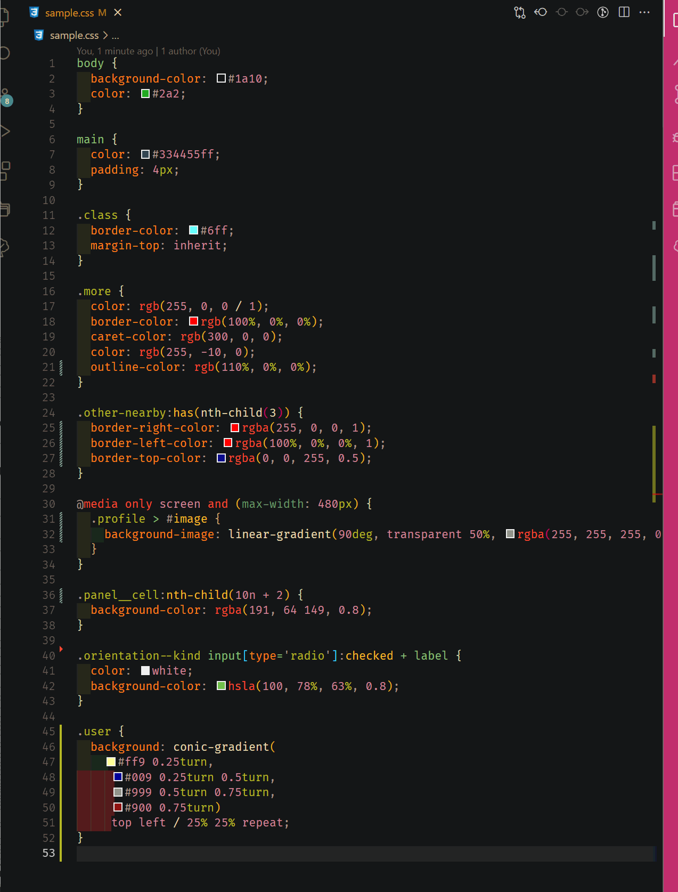

# color-collector

a simple vs code extension which works with .CSS files

which collect all color code from a css file 
and assign the color in a variable 
and add a :root selector which contains all variables 
and also replace the color code with new variable name

so that once all color collected on one place, we can change theme by changing that :root color-schema only

## Features

- support all color format except where user described turn|rad as color variable

#### input

#### output

## Requirements

user must have installed
- node js
- vs code

## Extension Settings
run `cfg`

## Known Issues

- currently selector not getting changed , all comes with first variable name.

## TODO

 - check whether file is correct ( i.e. valid css file)
 - check file is in save mode
 - confirm before leaving the file after conversion or prompt the user create a copy of file
 - handle error if no selector/color present in file
 - comments need to be escaped while parsing the css
 - other at rules selector need to handle such as 
  
     - `@keyframes`,
     - `@import`,
     - `@media`
     - `@container` , 
     - `@page` , 
     - `@supports` ,
     - `@charset`,
 - need to captured named color also.

## Release Notes

## TODO

- support all format
- when there are multiple color on same line such as liner-background()
- - remove keyframes/ import / media / container
