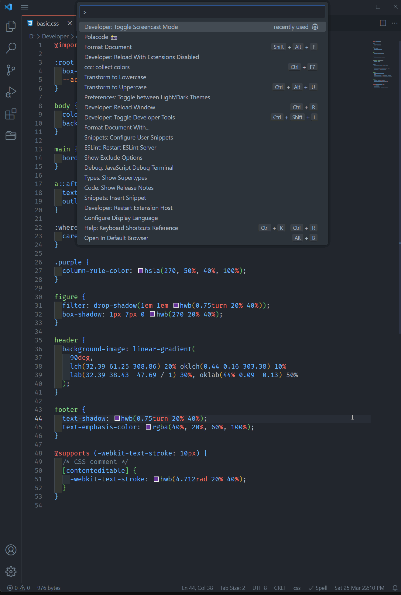
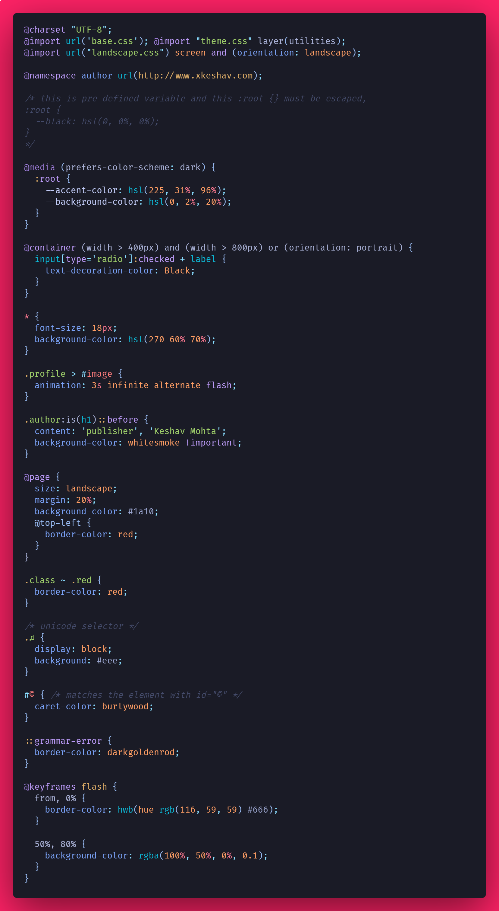
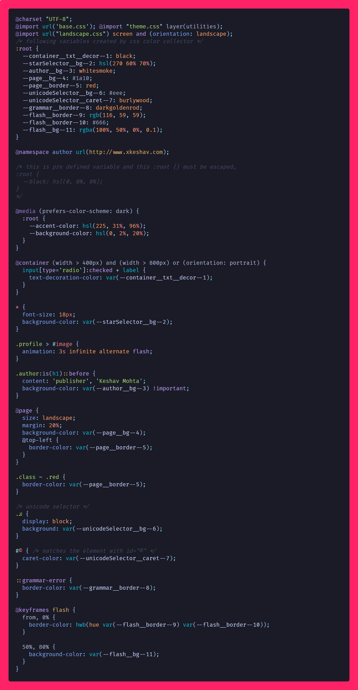

# color-collector

A simple vs code extension that works with _.css_ files and assigns all colors into the css variables.

## Description

In an open CSS file, this extension scans for all color values.
and collect the color value and assign into an individual variable for every different color and include all these variables in a `:root` selector at the top of document.
and replace the color values with the new variable name in the same CSS file,

## Install

- Open Extensions sideBar panel in Visual Studio Code and choose the menu options for _View → Extensions_ or use `Ctrl + Shift + X` or `Cmd + Shift + X`
- Search for `css color collector`
- Click _Install_

## Features

- Collect all color format, including `hex`, `rgb`, `rgba`, `hsl`, `hsla`, `hwb` and 148 named color.
- Names of variables are intuitive and include property and selector as prefixes
- Prevent duplicate color and assign it into same variable name ( which comes first in file)
- a different hex format of color also counted as duplicate color and handled properly. for eg. `#fff` and `#ffffff` and `#fffffff` are same color

```css
body {
  background-color: whitesmoke;
}
```

converted into

```css
:root {
  --body-bg-1: whitesmoke;
}

body {
  background-color: --body-bg-1;
}
```

note: variable ends with `-<num>` to keep track how many colors are collected and used, further you can rename the variable using `Rename Symbol(F2)` action in vs code.

- After successfully execution of the command, the css file will be changed where color value will be replaced by css variables and a `:root` selector will be placed on the top of the file,after all `import` statements and also display notification of successful conversion.

## Extension Usage

- Open a css file
- Press <kbd>F1</kbd> to open the command palette
- Type `ccc: collect css` or type <kbd>Ctrl + F7</kbd> or <kbd>Cmd + F7</kbd>
- After conversion done, you will see notification on bottom with message _CSS variable conversion done successfully!_

## Working Demo



## Examples

### Basic

#### input file


#### output file


### Advance

#### input file



#### output file



## check-list

- [ ] check whether file is correct (i.e. valid css file)
- [ ] check file is in save mode
- [x] handle when no color present in the css file
- [x] comments need to be escaped while parsing the css
- [x] other at rules selector need to handle such as

  - `@keyframes`,
  - `@import`,
  - `@media`
  - `@container` ,
  - `@page` ,
  - `@supports` ,
  - `@charset`,

- [x] need to captured named color also.
- [x] support all color format ,
- [x] when there are multiple color on same line such as liner-background()
- [x] insert :root after _@import_ statements
- [ ] media query selector name need to append media in variable name
- [x] skip :root {} while scanning document
- [] capture unicode selector such as 🎵

## Release Notes

- This is first version and my first extension so if you find it useful then please support it by installing and giving feedback.

### Known issues

- error _"invalid flag 'dgim'"_
  if you run the command or press `Ctrl + F7` and get above error then check whether you have [todo-tree extension](https://marketplace.visualstudio.com/items?itemName=Gruntfuggly.todo-tree) enabled in your vs code then please disable this extension, the reason is unknown so far, [issue raised for the same](https://github.com/Gruntfuggly/todo-tree/issues/732)

- if you found any issue, kindly raise [here](https://github.com/xkeshav/color-collector/issues/)

## TODO

- [ ] add feature to change variable naming for property , currently its hard coded like if property is `background-color` then its variable name would be `bg`
