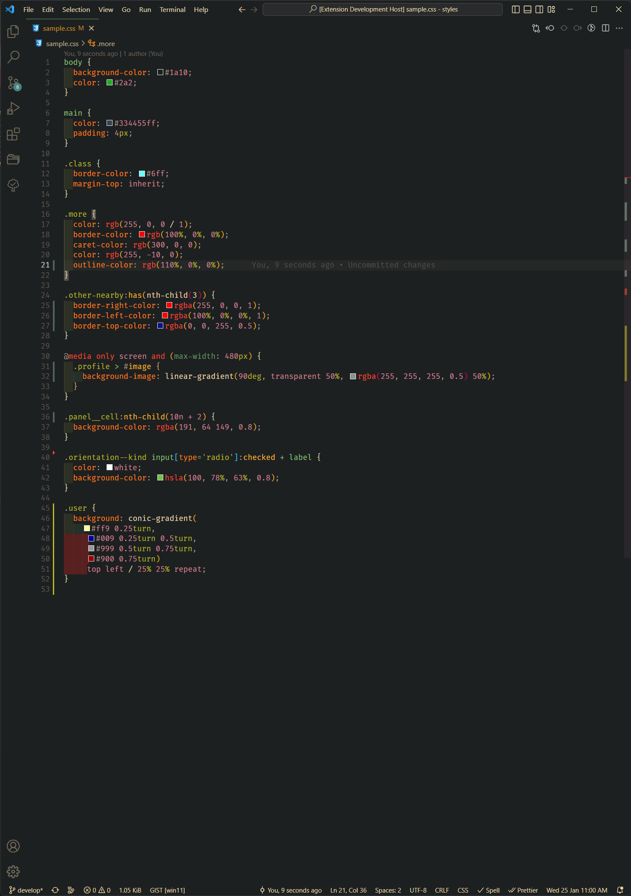
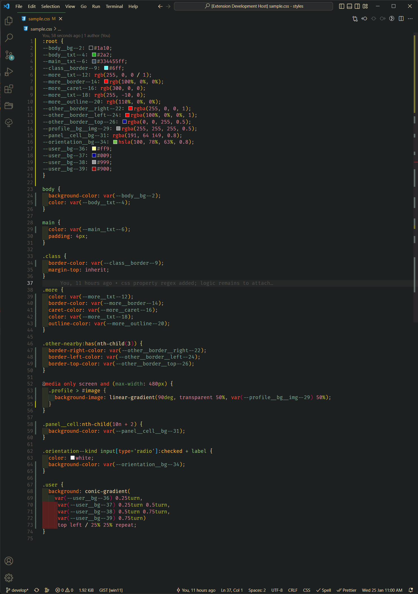

# color-collector

a simple vs code extension which works with .css files

which collect all color code from a css file
and assign the color in a variable
and add a :root selector which contains all variables
and also replace the color code with new variable name

so that once all color collected on one place, we can change theme by changing that :root color-schema only

## Features

- support all color format
- parse css file with all At Rules
- duplicate color comes under one variable ( all hex format )

![collect and convert color into variable gif][collect]

#### input

#### output

## Requirements

user must have installed

- node js
- vs code

## Extension Settings

run `cfg`

## Known Issues

- media query selector name need to append media in variable name
- selecting color named selector such as .red as a color which need to fix

## CHECK-LIST

- [ ] check whether file is correct (i.e. valid css file)
- [ ] check file is in save mode
- [ ] confirm before leaving the file after conversion or prompt the user create a copy of file
- [ ] handle error if no selector/color present in file
- [x] comments need to be escaped while parsing the css
- [x] other at rules selector need to handle such as

  - `@keyframes`,
  - `@import`,
  - `@media`
  - `@container` ,
  - `@page` ,
  - `@supports` ,
  - `@charset`,

- [x] need to captured named color also.
- [x] support all color format
- [x] when there are multiple color on same line such as liner-background()
- [x] insert :root after _@import_ statements

## Release Notes

- This is in beta version, need to write unit test for all code

### foot note

- if you have todo-tree extension enabled then this extension will likely to fail , reason unknown so far, [issue raised here](https://github.com/Gruntfuggly/todo-tree/issues/732)

[collect]: images/collector.gif