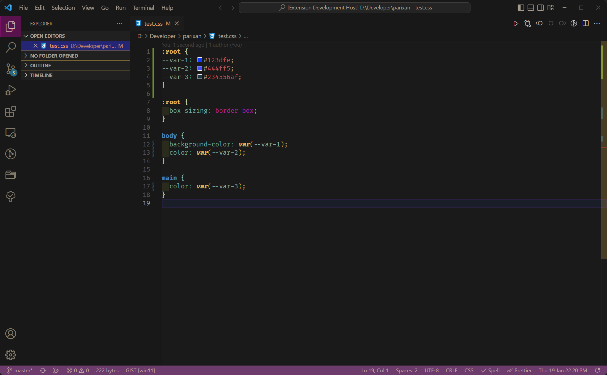

# css-variable-generator README

This is the README for your extension "css-variable-generator".

creating a extension which collect all color code from a css file and assign the color in a variable and add a :root selector which contains all variables and also replace the color code with new variable name

so that once all color collected on one place, we can change theme by changing that :root color-schema

## Features

- support all color format except where user described turn|rad as color variable

#### input

#### output

> Tip: Many popular extensions utilize animations. This is an excellent way to show off your extension! We recommend short, focused animations that are easy to follow.

## Requirements

If you have any requirements or dependencies, add a section describing those and how to install and configure them.

## Extension Settings

## Known Issues

- currently selector not getting changed , all comes with first variable name.

## Release Notes

## TODO

- support all format
- when there are multiple color on same line such as liner-background()
- - remove keyframes/ import / media / container
